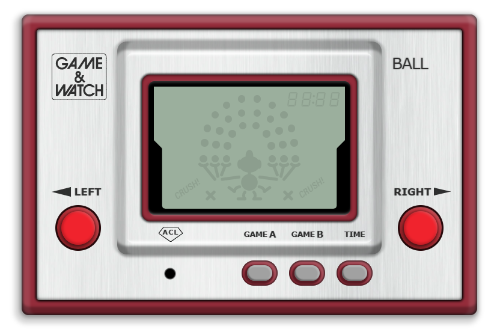

<h1 align="center">
  <br>Game & Watch BALL
</h1>

<h4 align="center">A functioning digital mockup of Nintendo's first handheld console, by Fede Báez.</h4>

<br>
<p align="center">
  <a href="#about">About</a> •
  <a href="#usage">Usage</a> •
  <a href="#features">Features</a>
</p>

---

```diff
! Disclaimer: Rapid prototyping - Not clean code
```

## About

<table>
<tr>
<td>

This app was developed as a training exercise. <a href="https://fbgoode.github.io/GWBall">Check out the result here</a>.

**GWBall** is a digital mockup of Nintendo's classic handheld game "Game & Watch BALL", built with HTML5, CSS3 and vanilla JS.
The game may be played in any modern browser, including mobile.

<p align="center">
<br>
<sub>Screenshot (PC, Chrome v87)</sub>
</p>

<h3>About the console</h3>
<p>
<sub>Source: <a href="https://en.wikipedia.org/wiki/Game_%26_Watch">Wikipedia</a></sub>
</p>

The **Game & Watch** brand is a series of handheld electronic games developed, manufactured, released and marketed by Nintendo from 1980 to 1991. Created by game designer Gunpei Yokoi, the product derived its name from its featuring a single game as well as a clock on an LCD screen. The series sold a combined 43.4 million units worldwide, and was the earliest Nintendo video game product to gain major success.

**Ball** is a Game & Watch game released as a part of the Silver series on April 28, 1980. It was the first Game & Watch game. It is a single-screen single-player Game & Watch.

In Game A, the player tosses two balls in the air. As the balls fall, the player must catch and toss them up again. One point is earned for each successful catch. A dropped ball will display a broken ball and end the game. The object is to continuously catch the balls that fall and throw them back up, as in juggling. In Game B, the player must juggle three balls, and each successful catch rewards ten points instead of one.

</td>
</tr>
</table>

## Usage

You may play the game directly from its <a href="https://fbgoode.github.io/GWBall">GitHub Pages deployment</a>.

##### 1. Open game

##### 2. Select game mode A (easier) or B (harder) clicking on buttons or with keyboard keys "A" or "B"

##### 3. Use left/right buttons or arrow keys to move juggler and prevent the balls from falling to the ground

##### 4. Check the local time with "TIME" button or key "T"
<br>

## Features

* Responsive
* Includes sounds
* Mouse/touch controls
* Keyboard controls
* Functions as the original console with a slight step up in game difficulty
* Only HTML5, CSS3 and vanilla JS
